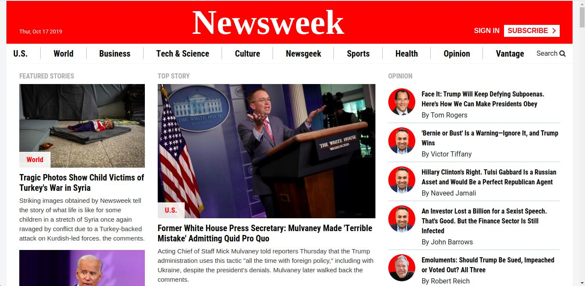

# NewsWeek

> This is a solo project to build a replica of the news site Newsweek.com using the Bootstrap framework.




## Built With

- Major languages
  - Html
  - Css
- Frameworks
  - Bootstrap 4
- Technologies used
  - Html
  - Css
  - Bootstrap 4
  - Git && Github

## Live Demo (if available)

[Live Demo Link](https://raw.githack.com/Qoosim/newsweek/news/index.html) :point_left:


## Getting Started

### Prerequisites

- IDE to edit and run the code (We use Visual Studio Code fire).
- Git to versionning your work.

### Install

To get a local copy up and running follow these simple example steps.

- Clone the repository using:
 ```
    git clone git@github.com:Qoosim/newsweek.git
```
- Navigate to the newsweek with this command 
 ```
   cd newsweek 
 ```
 - Install Visual Studio extension [Live Server](https://marketplace.visualstudio.com/items?itemName=ritwickdey.LiveServer)

### Usage

- Enable Live Server

- Play around the site


## Author

👤 **Qoosim AbdulGhaniyy**

- GitHub: [Qoosim](https://github.com/Qoosim)
- Twitter: [Qoosim](https://twitter.com/qoosim_ayinde)
- LinkedIn: [Qoosim](https://linkedin.com/in/qoosim)

## 🤝 Contributing

Contributions, issues, and feature requests are welcome!

Feel free to check the [issues page](../../issues/).

## Show your support

Give a ⭐️ if you like this project!

## Acknowledgments

- Hat tip to anyone whose code was used
- Inspiration
- etc

## 📝 License

This project is [MIT](./MIT.md) licensed.
